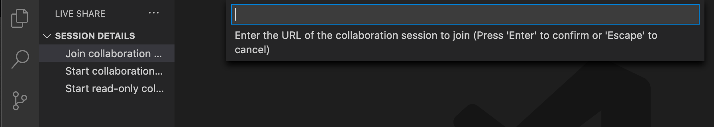

# Live Share

This guide will help you properly set up and use [Live Share](https://code.visualstudio.com/learn/collaboration/live-share).

## What is Live Share?

Live Share enables you to quickly collaborate with a friend, classmate, or professor on the same code without the need to sync code or to configure the same development tools, settings, or environment.

## Get started with Live Share

To get started with using Live Share in VS Code, you'll need to download the [Live Share Extension Pack](https://marketplace.visualstudio.com/items?itemName=MS-vsliveshare.vsliveshare-pack) from the Extension Marketplace.
<!-- add a image from images/livesharepack.png-->

This extension pack includes everything you need to start collaboratively editing and debugging in real time, including integrated audio and text chat. This provides you and your team/class with a one-click installation, in order to begin pair programming, performing remote code reviews, driving interactive lectures, and more, without needing to leave Visual Studio Code.

Once you log into your GitHub account, you'll see the Live Share icon in the Activity Bar.

## Starting a Live Share session

If you select Start Collaboration session from the Session Details menu, an invitation link to your session will automatically be copied to your clipboard. You can share this link with anyone you'd like to collaborate with, as long as they also have VS Code and the Live Share Extension Pack downloaded.

When your teamate joins the session, you'll get a notification, and see their name come up under Participants.

## Joining a Live Share session

If you select Join Collaboration session from the Session Details menu, you're able to enter the URL you received.

